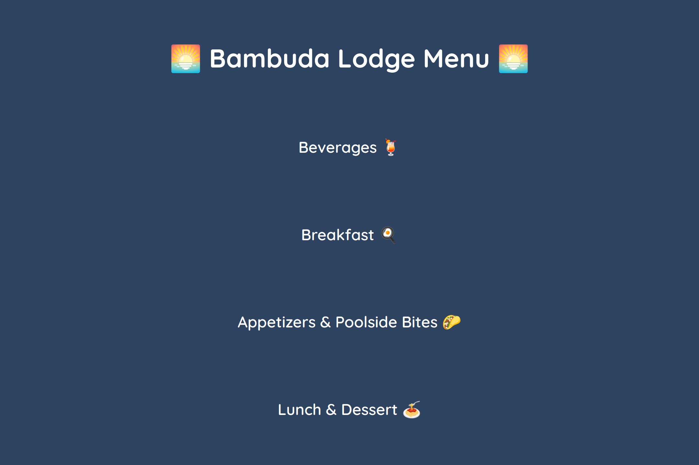
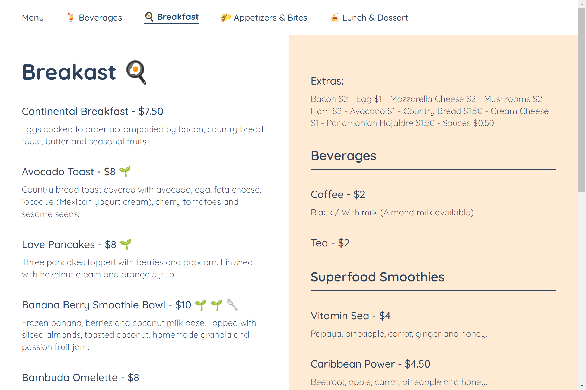

# Restaurant Page 🍔

  

  

<h2 align="center">
  <a href="https://nightrunner4.github.io/restaurant-page">👉 Demo</a>
</h2>

### About 📖

Third project of the JavaScript chapter in [The Odin Project](https://www.theodinproject.com). The challenge was to create a restaurant menu using only JS, CSS and Webpack. The menu is a replica of [Bambuda Lodge](https://bambuda.com/lodge/).

### Resources Used 📚

- [Google Fonts](https://fonts.google.com) (Icons & Font)
- [EmojiTerra](https://emojiterra.com/) (Emojis)

### Built With 🛠️

- Webpack
- JS
- CSS
- HTML